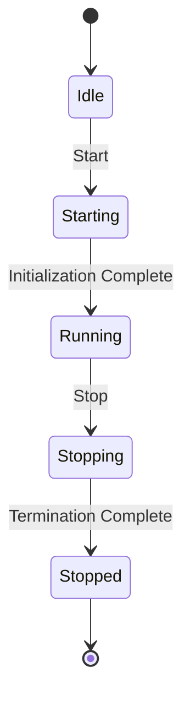

# 상태 다이어그램

## 개요
이 문서는 프레임워크 웹서버 옥토퍼스 서비스의 상태 다이어그램을 제공합니다. 상태 다이어그램은 서비스가 라이프사이클 동안 겪을 수 있는 다양한 상태와 전환을 보여줍니다.

## 상태 다이어그램

## 상태
- **Idle**: 서비스가 시작되기 전의 초기 상태입니다.
- **Starting**: 서비스가 시작 중인 상태입니다.
- **Running**: 서비스가 실행 중이며 운영 가능한 상태입니다.
- **Stopping**: 서비스가 종료 중인 상태입니다.
- **Stopped**: 서비스가 종료되어 더 이상 실행되지 않는 상태입니다.

## 전환
- **Start**: Idle에서 Starting으로의 전환.
- **Initialization Complete**: Starting에서 Running으로의 전환.
- **Stop**: Running에서 Stopping으로의 전환.
- **Termination Complete**: Stopping에서 Stopped로의 전환.

## 참고 사항
- 모든 전환이 원활하게 처리되어 서비스 안정성을 유지하도록 하십시오.
- 상태 전환 중 서비스를 모니터링하여 문제를 신속하게 감지하고 해결하십시오.
